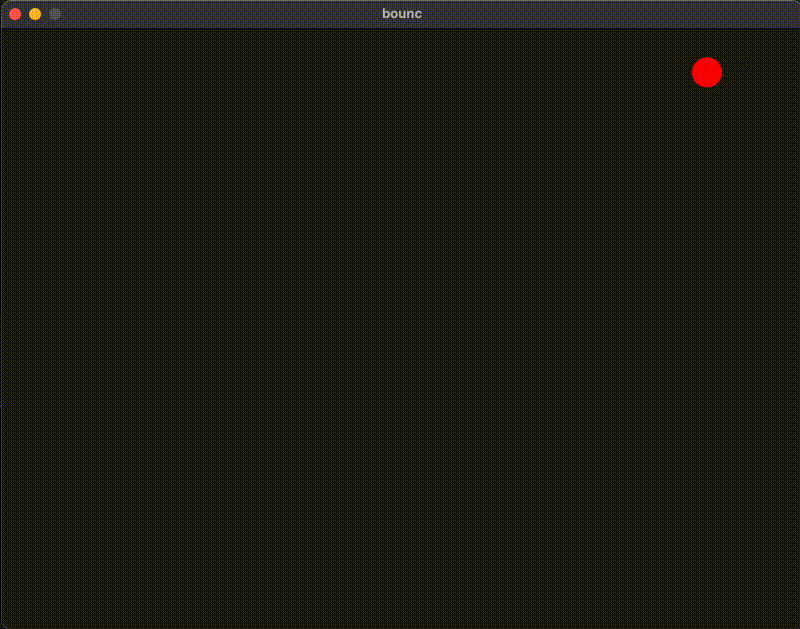

# bounc

A simple ball physics simulation built with Raylib in C. Features interactive red balls that bounce around the screen with real-time controls.

## Controls

- **Left Click**: Add a new ball at cursor position
- **SPACE**: Pause/Resume simulation
- **ESC** or **Close Window**: Exit application

## Prerequisites

- C compiler (GCC, Clang)
- [Raylib](https://www.raylib.com/)

## Compilation

```console
make run
```

## Demo



## TODO

- Configurable ball speed
- Ball spawn animation
